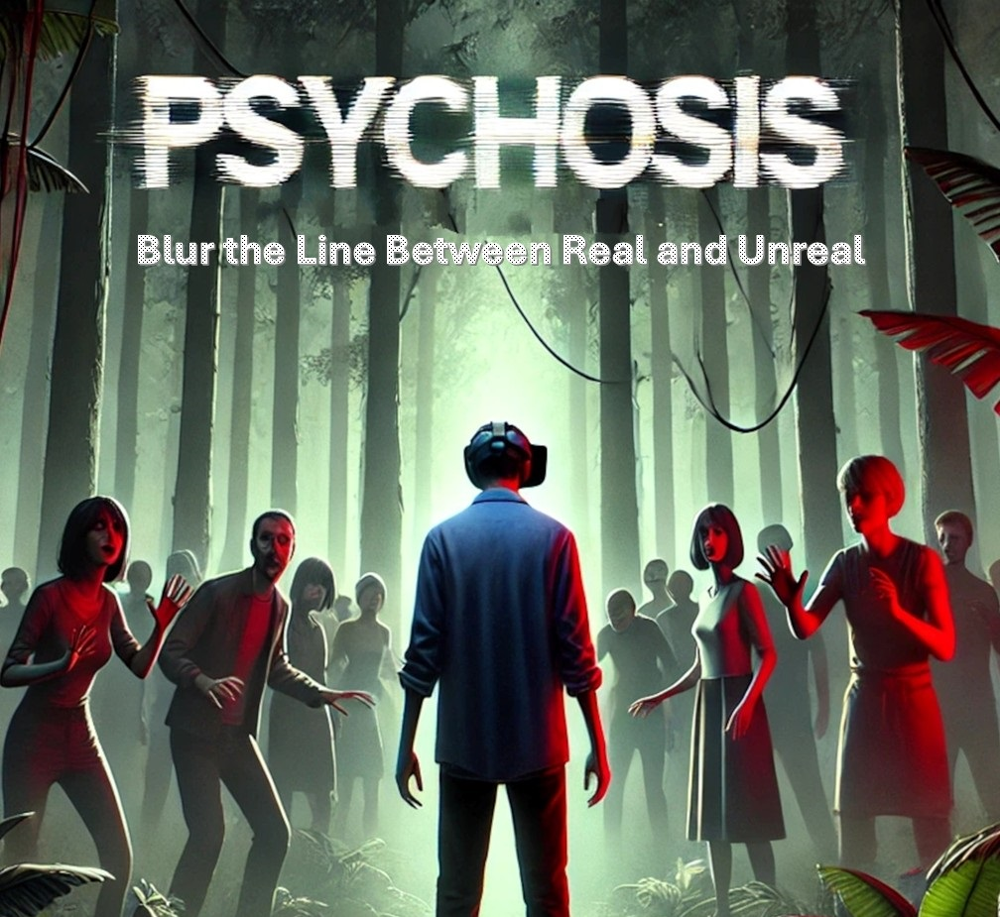
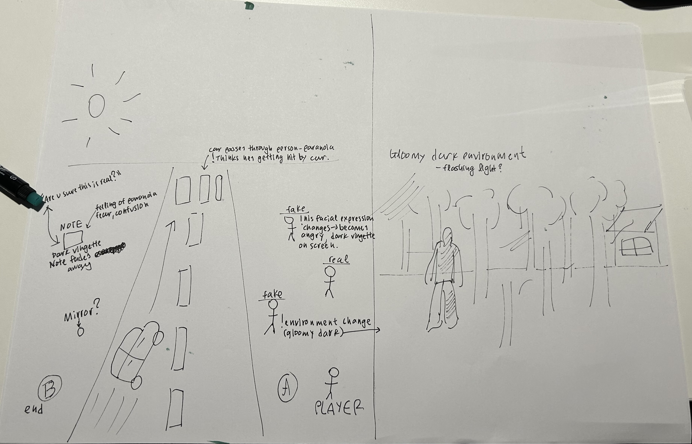

<h1> PSYCHOSIS </h1>



## Introduction

Psychosis is a Virtual Reality (VR) experience that lets users step into the shoes of someone experiencing hallucinations and delusions. The goal is to help people understand what it’s like to live with psychotic disorders in an immersive and interactive way. The problem detected is that many people struggle to understand what it is like to live with hallucinations. 


This will raise awareness of the impact of living with hallucinations. Our solution is helpful because it lets users experience hallucinations in a safe, virtual way. When you are seing and feeling what it’s like, users can better understand psychosis. This encourages more supportive attitudes toward mental health. VR is great for this because it lets users feel like they’re really there. It’s much more powerful than just reading or watching videos about psychosis. This way, users can better understand what people with these conditions go through.


The proposed solution is valuable because it provides an immersive, interactive, and educational experience. It uses VR to create a 3D environment where users can explore and interact with the world as if they were experiencing psychosis themselves. VR makes you feel like you’re actually in the environment, which helps you understand the experience better. It is interactive because you can touch objects, hear voices, and see hallucinations, which makes the experience feel real. It is also a controlled environment, so users can explore without fear or risk.


When people understand the condition better, they’re more likely to be supportive and less judgmental. Feeling what it’s like to live with psychosis helps users connect with those who have the condition. The experience starts normal and slowly introduces distortions, so it’s not overwhelming. Users can interact with objects and people, triggering hallucinations and seeing how their actions affect the environment.

## Design Process



<h3> Brainstorming </h3>

We started by brainstorming ideas for the project that matched the topic educational experience for people with disabilities using immersive technologies and tangible interaction. We wanted to create something that is an educational experience for people with disabilities using immersive technologies and tangible interaction could show what hallucinations feel like in a way that’s both educational and immersive. 

The first thing we did was define the purpose. We asked ourselves, what do we want users to take away from this? The answer was simple: awareness and empathy. We wanted healthy users to step into the shoes of someone experiencing hallucinations and understand how disorienting and unsettling it can be. From there, the ideas started flowing.

We imagined a bustling street scene, something familiar and relatable that could suddenly shift into a distorted, hallucinatory version. The idea was to create a stark contrast between reality and the altered perception of someone with psychosis. We talked about how the environment could morph, which were colors changing, objects shifting, and lighting becoming eerie. We also thought about adding auditory hallucinations and these were whispers, echoes, and distorted sounds, to heighten the sense of paranoia.

Then came the interactions. We wanted users to feel like they were part of the experience, not just passive observers. We brainstormed ways they could interact with the environment. For example, touching people and hearing whispers around them, picking up objects like a mysterious note, and triggering hallucinations through these actions. 

Teleportation was something we wanted to create because it was not about moving around. Instead, it was about making the user feel like reality was shifting, just like it does for someone experiencing hallucinations. That was the feeling we were going for. This movement stood out because it fits with the theme of Psychosis. Since the experience is shifting realities and unpredictable changes, teleportation creates those sudden, jarring shifts in the environment. 

We had to think about the technical side too. We discussed whether the user should feel their movements. We discussed haptic feedback and how the controllers could vibrate when the user touched someone or interacted with objects. We also considered heat feedback to intensify emotional responses in certain environments. We also made a timeline to stay organized, where we split the work into steps: research and prototyping, UX design, finishing the main features, testing, and then launching the final product. 

<h3> User research </h3>

The user research began with observations around us. We asked ourselves, do people actually know how it feels to experience psychosis? What we noticed was eye-opening. Many people didn’t really understand what it’s like to live with psychosis or experience hallucinations. Some had misconceptions, thinking it was just "seeing things" or "hearing voices" in a simple way. Others were curious but didn’t know much about it, and they were saying things like "I’ve heard about it, but I don’t really get what it’s like".

We also paid attention to how people talked about mental health in general, and we noticed that when people talked about mental health, they often used simple or unclear terms. For example, some thought hallucinations were just "seeing things," without understanding how emotional they could be. Others had heard of psychosis but didn’t realize how much it could change someone’s sense of reality. 

The insights we gained from it showed us how little people understood about psychosis and mental health, and that is why we wanted to make something that could help people feel what it’s like to experience hallucinations, but in a way that was easy to approach and not too overwhelming.

<h3> User persona </h3>
Our target persona in this project is healthy users interested in understanding what it is like to live with psychosis. The project addresses them by showing how reality can become for people experiencing psychosis through environmental shifts. It also provides an impactful experience to the target user that encourages empathy and understanding for those living with psychotic disorders.

<h3> User journey </h3>
The user starts in a normal street environment. At a certain trigger, the environment shifts to a hallucination mode, and this switch between a familiar street scene and a distorted version where colors, lighting, and objects morph to reflect a hallucination. <br></br>

The visualization of how the user interacts with our project is that when you start the app, you find yourself in a normal street environment with people, cars, and buildings around you. You can interact with things around you using handgrab interactions and distancegrab interactions. With these interactions, you can reach out and touch people. For example, you might touch a person which feels strange and unsettling. With distance grab, you can pull objects closer from far away, like grabbing another woman, and see that triggers a sudden change in the environment. Also grabbing a mysterious note.

The app uses a scene loader script to switch between normal and hallucinated scenes. One moment, the street looks normal and the next, it becomes dark, distorted, and filled with strange sounds. When the sudden change becomes real, it helps you understand how confusing and unpredictable psychosis can be.

To make the experience feel more real, the app uses haptic feedback, which makes the VR controllers vibrate when you touch something. For example, if you touch a person, the controllers vibrate, and this will make you feel confused when interacting with them. 

Sound is also a big part of the experience. The app uses facial audio to create voices and sounds that seem to come from different directions. You might hear whispers in your ear when you touch a person, even though the person is not actually speaking. When hearing these sounds, it makes you feel paranoid and confused, just like someone with psychosis might feel.

The app also uses light distortion scripts to change the lighting and colors in the environment. Shadows might stretch and colors become dark. When you feel these changes, it can make the world feel unstable and unreal, which continues the feeling of being in a hallucination.

## System description

### Features

[_Features and functionalities of your project. You can use bullet points, screenshots, gifs, or videos to illustrate your points. Also include a link to a demo or a live version of your project._]

For example:

- Immersive and realistic 3D models of [...]
- Interactive and intuitive controls using hand gestures and voice commands
- Customizable settings and preferences for the user experience
- Compatible with various XR platforms and devices

Watch the demo video or try the live version.

Link: <https://extralitylab.dsv.su.se/>

## Installation

To install and run Psychosis on your platform or device, follow the instructions below:

| Platform   | Device       | Requirements                                                                 | Commands                                                                                                                                                                                                 |
|------------|--------------|------------------------------------------------------------------------------|---------------------------------------------------------------------------------------------------------------------------------------------------------------------------------------------------------|
| **Windows** | Meta Quest   | Unity 2022.3.47.f1 (exact version required), Meta XR Plugin, Git, 8GB RAM, dedicated GPU | `git clone https://github.com/ImanDashtpeyma/PSYCHOSIS.git`<br>`cd PSYCHOSIS`<br>`Open in Unity Hub with version 2022.3.47.f1`<br>`Configure Meta XR Plugin`<br>`Build and Run for Windows/Standalone` |
| **Android** | Phone   | Unity 2022.3.47.f1 (exact version required), Meta XR Plugin, Git, 8GB RAM, dedicated GPU, Developer Mode enabled on Quest | `git clone https://github.com/ImanDashtpeyma/PSYCHOSIS.git`<br>`cd PSYCHOSIS`<br>`Open in Unity Hub with version 2022.3.47.f1`<br>`Configure Meta XR Plugin`<br>`Switch platform to Android`<br>`Build and Run` |

---

## Requirements

| Requirement           | Details |
|----------------------|---------|
| Unity Version       | **2022.3.47.f1** (exact version required) |
| Device              | Meta Quest headset |
| Plugin              | Meta XR Plugin for Unity |
| Software           | Git installed on your computer |
| Hardware            | Minimum **8GB RAM** and a **dedicated GPU** recommended |


---

## Installation Steps

### Step 1: Clone the Repository
```sh
git clone https://github.com/ImanDashtpeyma/PSYCHOSIS.git
cd PSYCHOSIS
```

### Step 2: Open in Unity
1. Launch **Unity Hub**.
2. Click **"Add"** and browse to the cloned `PSYCHOSIS` folder.
3. Ensure Unity version **2022.3.47.f1** is selected when opening the project.
4. Unity will automatically install required packages and dependencies.

### Step 3: Configure Meta XR Plugin
1. In Unity, go to **Edit > Project Settings > XR Plugin Management**.
2. If not installed, click **Install XR Plugin Management**.
3. In the **Android** tab, check the box for **Oculus**.
4. In the **Windows/Standalone** tab, also check the box for **Oculus**.
5. Navigate to **Edit > Project Settings > XR Plugin Management > Oculus**.
6. Configure settings:
   - Enable **"Stereo Rendering Mode"** to **"Multi Pass"** for better performance.
   - Set appropriate **"Target Devices"** (Quest, Quest 2, etc.).

### Step 4: Configure build settings
1. Go to **File > Build Settings**.
2. Select the target platform:
   - **For direct headset play:** Select **Android**.
   - **For PC-connected play:** Select **Windows, Mac, Linux**.
3. Click **Switch Platform** if not already set.
4. **For Android builds:**
   - Set **Texture Compression** to **ASTC**.
   - Set **Minimum API level** to **Android 10.0 (API level 29)** or higher.

### Step 5: Build and run
1. Connect your **Meta Quest headset** to your computer via USB.
2. Enable **Developer Mode** on your Quest if not already enabled.
3. In Unity, click **Build and Run**.
4. Follow on-screen prompts to complete the build process.

## Experiencing PSYCHOSIS

Once installed on your Meta Quest, you'll enter an immersive VR environment to simulate psychosis. The experience begins in a **normal street environment** and gradually introduces **hallucinations** and **delusions** triggered by interactions. Use your Quest controllers to navigate and interact with the environment.

## Troubleshooting

If you encounter any issues during installation:

- Ensure you're using **Unity version 2022.3.47.f1**.
- Verify that **Meta XR Plugin** is properly installed and configured.
- Make sure your **Meta Quest headset** is in **Developer Mode**.
- Check that **USB debugging** is enabled on your Quest.
- If the build fails, check the **Unity console** for specific error messages.
- Try **restarting Unity and/or your Quest** if experiencing connection issues.

## Controls

| Action | Quest controller input |
|--------|------------------------|
| Move around | Use the joysticks |
| Interact with objects | Use the grip buttons |
| Explore the interactions | Use the trigger buttons |


